<p align="center">
  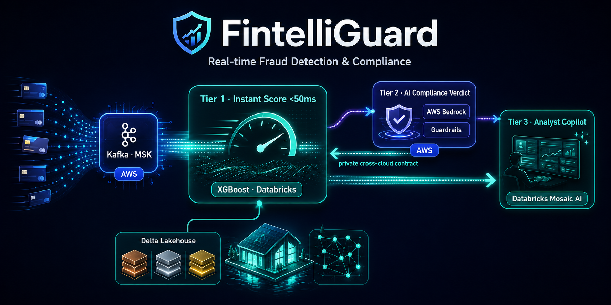
</p>

# FintelliGuard

<p align="center">
  <a href="https://github.com/theofanis-tsakanikas/fintelliguard/actions/workflows/ci.yml"></a>
  <a href="LICENSE"></a>
  
  
  <br>
  
  
  
  
  
  <br>
  
  
  
  
</p>

**Real-time financial fraud detection & compliance platform.**
*AWS Bedrock · Databricks Mosaic AI · Kafka / MSK · Spark · XGBoost · Terraform · GitHub Actions*

> **The name** — **Fin**(ancial) + **Intelli**(gence) + **Guard**: it *guards* financial
> transactions *intelligently*. The "Guard" is literal — Bedrock **Guardrails** are a
> first-class, CI-enforced control in Tier 2.

---

## Contents

- [The problem](#the-problem) · [Status — proven live, then torn down](#status--proven-end-to-end-on-real-cloud-then-torn-down)
- [Architecture — three tiers, two clouds](#architecture--three-tier-decisioning-two-zone-genai)
  - [The decisioning funnel](#the-decisioning-funnel) · [Tier 1 · scorer](#tier-1--the-scorer-xgboost-on-mosaic-ai-model-serving) · [Tier 2 · compliance agent](#tier-2--the-compliance-agent-aws-bedrock) · [Tier 3 · analyst copilot](#tier-3--the-analyst-copilot-databricks-mosaic-ai)
- [Data flow — the medallion pipeline](#data-flow--the-medallion-pipeline-dlt)
- [The private cross-cloud path (MSK ↔ Databricks)](#the-private-cross-cloud-path-msk--databricks)
- [CI/CD & IaC](#cicd--iac--everything-is-gated-nothing-is-by-console) · [Observability](#observability) · [Regulated-AI docs](#regulated-ai-generated-from-the-code)
- [Quickstart](#quickstart) · [Testing](#testing) · [Repository layout](#repository-layout)
- [What this does not do](#what-this-does-not-do) · [Cost](#cost) · [Decisions](#decisions)
- [Docs](#docs) · [Security](#security) · [License](#license)

---

## The problem

Card-fraud systems fail on two fronts at once. Rule engines flag transactions *after*
approval, so losses are booked before an analyst opens the case. And AML / PSD2 require a
**documented, regulation-grounded justification for every flagged transaction** — work a
mid-size bank throws 40–80 analysts at.

FintelliGuard scores **every** transaction in under 50 ms, auto-drafts a
regulation-grounded compliance verdict for the suspicious ~1%, and gives analysts an AI
copilot to investigate the rest, attacking fraud latency and compliance cost in one system.

## Status — proven end-to-end on real cloud, then torn down

This is not a "runs on my laptop" repo. The whole estate was **provisioned on real AWS +
Databricks through CI, exercised end-to-end, captured, and then destroyed to zero cost**
(the teardown is a first-class, guarded workflow). Everything below is backed by a real run;
the screenshots are from it. Bringing it back up is one `Deploy` dispatch.

<p align="center">
  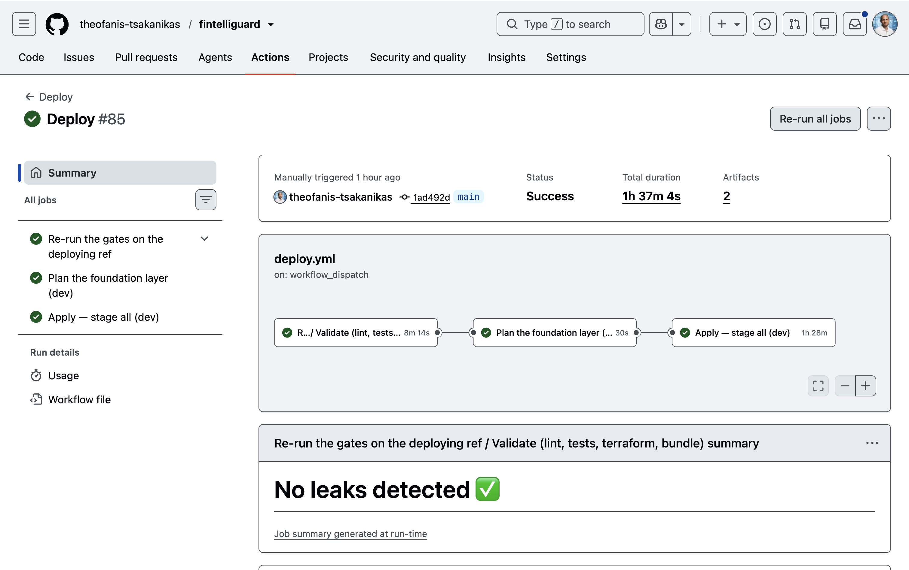
</p>

<sub><b>One dispatch, the whole estate</b> — three Terraform layers plus Databricks Asset Bundles: the medallion tables built, the model trained, gated, registered and served, the cross-cloud contract wired, and both agents live. <b>1h 37m</b>, every gate green, no secrets leaked.</sub>

---

## Architecture — three-tier decisioning, two-zone GenAI

A transaction flows through a funnel where each tier is more expensive and runs on a smaller
slice. The two GenAI zones live in their natural homes and are joined by a **contract, not
coupling**: Bedrock reaches the model *only* through `get_fraud_score()`, over private
connectivity, never public.

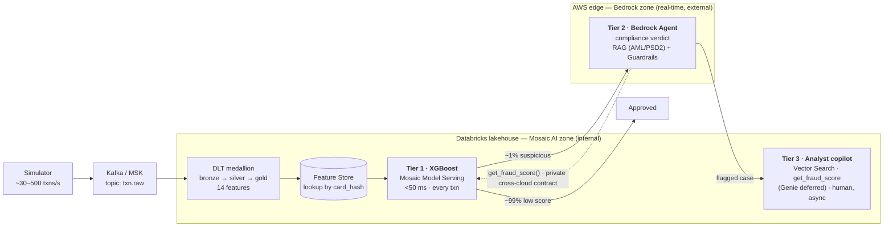
```mermaid
flowchart LR
  SIM["Simulator<br/>~30–500 txns/s"] --> K["Kafka / MSK<br/>topic: txn.raw"]
  K --> P["DLT medallion<br/>bronze → silver → gold<br/>14 features"]

  subgraph LAKE["Databricks lakehouse — Mosaic AI zone (internal)"]
    direction TB
    P --> FS[("Feature Store<br/>lookup by card_hash")]
    FS --> T1["<b>Tier 1 · XGBoost</b><br/>Mosaic Model Serving<br/>&lt;50 ms · every txn"]
    T3["<b>Tier 3 · Analyst copilot</b><br/>Vector Search · get_fraud_score<br/>(Genie deferred) · human, async"]
  end

  T1 -->|"~99% low score"| OK["Approved"]
  T1 -->|"~1% suspicious"| T2

  subgraph EDGE["AWS edge — Bedrock zone (real-time, external)"]
    T2["<b>Tier 2 · Bedrock Agent</b><br/>compliance verdict<br/>RAG (AML/PSD2) + Guardrails"]
  end

  T2 -. "get_fraud_score() · private cross-cloud contract" .-> T1
  T2 -->|"flagged case"| T3
```

- **Tier 1 — XGBoost on Mosaic AI Model Serving.** Scores every transaction in <50 ms (local p99 ~10 ms);
  ~99% pass and are done. The fast, numeric decision, with per-prediction **TreeSHAP**
  explanations.
- **Tier 2 — AWS Bedrock Agent.** Only the suspicious ~1%. Calls back for the score via
  `get_fraud_score()`, grounds a compliance verdict in AML / PSD2 via RAG, and passes it
  through **Guardrails**. The slow reasoning layer, never the scorer.
- **Tier 3 — Databricks Mosaic AI copilot.** Human analysts investigate flagged cases
  asynchronously with semantic case retrieval (Vector Search) and the same
  `get_fraud_score()`. Decision support, not automation.

<details>
<summary><b>Why two clouds, not one?</b></summary>

<br>

You *could* build all three tiers on Databricks alone: Mosaic AI has model serving, an agent
framework, and vector search. Two clouds is a deliberate choice, not a technical necessity:

- **It models a real brownfield bank.** The real-time edge (near the payment gateway) lives in
  AWS; the lakehouse lives in Databricks. Two teams, two platforms, joined by a contract, not
  coupling.
- **Each GenAI zone sits in its natural home.** Bedrock owns the real-time *regulated* verdict
  at the edge; Databricks owns the async copilot where the data lives; Tier 1 trains and serves
  where the features live (feature parity).
- **A narrow trust boundary.** Bedrock reaches the model only via `get_fraud_score()` over a
  private endpoint, and it never reads Delta or raw data. One platform would lose that boundary.
- **Managed compliance primitives.** Bedrock Guardrails + Knowledge Bases give auditable PII
  redaction and grounding for the regulated path out of the box.

**Honest trade-off:** a greenfield project with no AWS footprint could do it all in Databricks —
simpler, one bill, one IAM. Two clouds buys realism, separation, and managed compliance at the
cost of the cross-cloud integration, which is itself part of what this project demonstrates.

</details>

See [`docs/NARRATIVE.md`](docs/NARRATIVE.md) for the *why* and
[`docs/PROJECT_PLAN.md`](docs/PROJECT_PLAN.md) for the full component inventory.

---

## The decisioning funnel

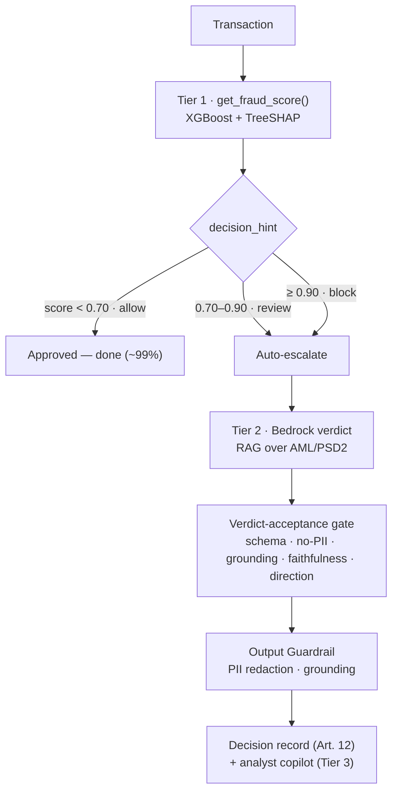
```mermaid
flowchart TD
  A["Transaction"] --> B["Tier 1 · get_fraud_score()<br/>XGBoost + TreeSHAP"]
  B --> C{"decision_hint"}
  C -->|"score &lt; 0.70 · allow"| D["Approved — done (~99%)"]
  C -->|"0.70–0.90 · review"| E["Auto-escalate"]
  C -->|"&ge; 0.90 · block"| E
  E --> F["Tier 2 · Bedrock verdict<br/>RAG over AML/PSD2"]
  F --> G["Verdict-acceptance gate<br/>schema · no-PII · grounding · faithfulness · direction"]
  G --> H["Output Guardrail<br/>PII redaction · grounding"]
  H --> I["Decision record (Art. 12)<br/>+ analyst copilot (Tier 3)"]
```

The orchestrator is `ml/serving/funnel.py`: it scores at Tier 1 and, only when
`decision_hint ∈ {review, block}`, auto-escalates (no human) to the Tier-2 agent. `allow`
clears. Proven live against the real Mosaic endpoint **and** the real Bedrock agent:

<table>
<tr>
<td width="50%">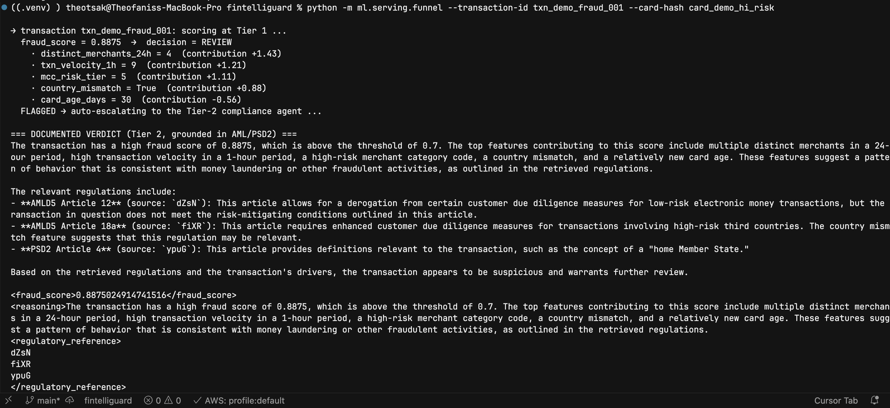<br><sub><b>Fraud → escalates</b> — <code>fraud_score = 0.8875 → REVIEW</code>, auto-escalated with no human in the loop, and a documented Tier-2 verdict citing <b>AMLD5 Art. 12 / 18a</b> and <b>PSD2 Art. 4</b>.</sub></td>
<td width="50%">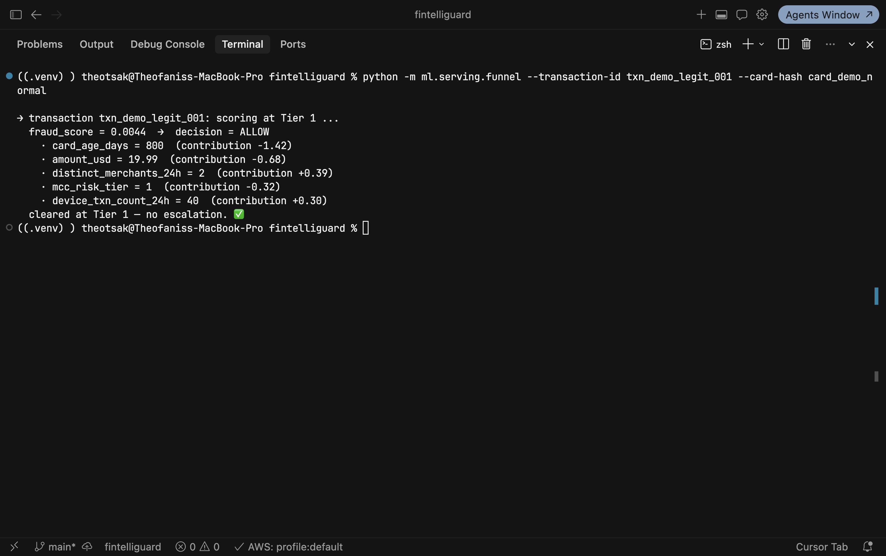<br><sub><b>Legitimate → clears</b> — <code>fraud_score = 0.0044 → ALLOW</code>, resolved at Tier 1 and never escalated. This is the ~99% path, and the reason the expensive tier stays affordable.</sub></td>
</tr>
</table>

---

## Tier 1 — the scorer (XGBoost on Mosaic AI Model Serving)

Trained on **IEEE-CIS** (590,540 transactions, 20,663 fraud = **3.50%**) with a compact,
**interpretable 14-feature** contract, not the anonymised `V1–V339`, so every feature is
explainable to a compliance analyst and computable online.

<details>
<summary><b>The 14 features</b></summary>

<br>

| Group | Features |
|---|---|
| Amount (3) | `amount_usd`, `amount_log`, `amount_zscore` |
| Velocity (4) | `txn_velocity_1h`, `txn_velocity_24h`, `amount_sum_1h`, `distinct_merchants_24h` |
| Identity & device (3) | `card_age_days`, `device_seen_before`, `device_txn_count_24h` |
| Geography (2) | `country_mismatch`, `distinct_countries_24h` |
| Merchant (1) | `mcc_risk_tier` |
| Temporal (1) | `is_unusual_hour` |

Full definitions in [`docs/features.md`](docs/features.md).

</details>

**Promotion policy (enforced in `ml/training/promote.py`):** Staging → Production only when
**AUC-ROC ≥ 0.83 AND fraud-class precision ≥ 0.85** on held-out test. Fail-closed. The live
run cleared it and registered `fintelliguard.ml.fraud_scorer` → alias `production`:

<p align="center">
  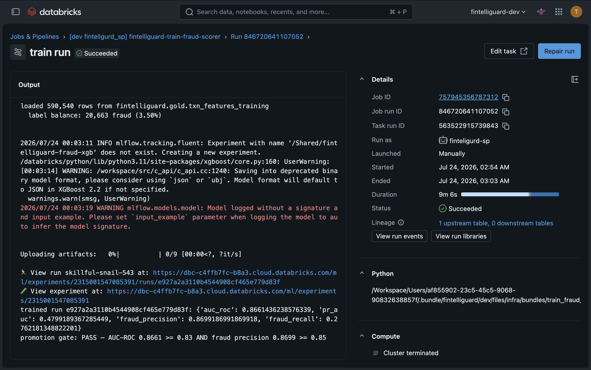
</p>

<sub><b>The gate, not a report</b> — <code>promotion gate: PASS — AUC-ROC 0.8661 ≥ 0.83 AND fraud precision 0.8699 ≥ 0.85</code>. A model that misses either number is not promoted; there is no override.</sub>

<table>
<tr>
<td width="50%">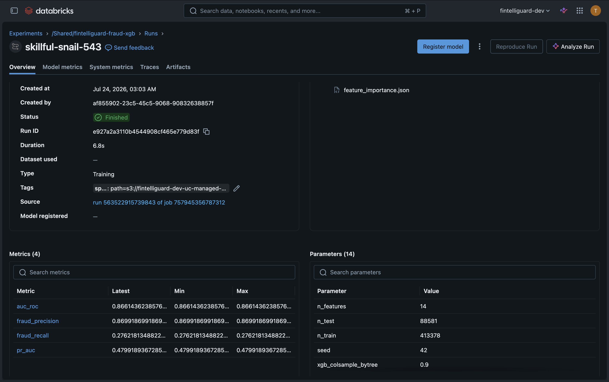<br><sub><b>The run</b> — MLflow metrics and the 14 logged parameters. The feature count is not a claim in a document; it is what the training run recorded.</sub></td>
<td width="50%">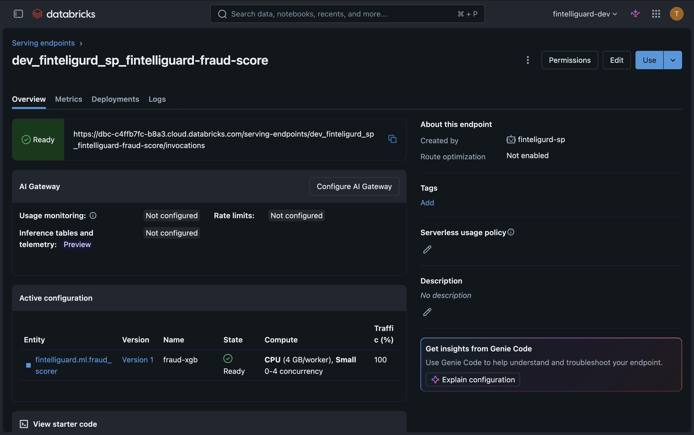<br><sub><b>The endpoint</b> — <code>fintelliguard-fraud-score</code>, <code>Ready</code>, sized <code>Small</code> with scale-to-zero so it costs nothing between demos.</sub></td>
</tr>
</table>

The scorer (`ml/serving/scorer.py`) bands the score (`≥ 0.90 → block`, `≥ 0.70 → review`,
else `allow`) and returns the exact per-transaction **TreeSHAP** contributions
(`pred_contribs`) as `top_features`: *why this transaction*, not global importance.

> The 14-feature contract is documented in [`docs/features.md`](docs/features.md); the
> canonical count is `len(FEATURE_SPECS)` in `ml/features/schema.py`. (A 15th,
> `merchant_risk_score`, was **removed, not faked**: it needs merchant identity *and* labels
> in one dataset, which no source here has.)

---

## Tier 2 — the compliance agent (AWS Bedrock)

Only the flagged ~1% reach it. The agent `fintelliguard-dev-fraud-investigator` (alias
`live`) calls back for the score via its `FraudScoring` action group, grounds a verdict in a
**Knowledge Base of verbatim EUR-Lex regulation** (AMLD5, GDPR, PSD2, RTS-SCA), and every
verdict passes an output **Guardrail**.

<table>
<tr>
<td width="50%">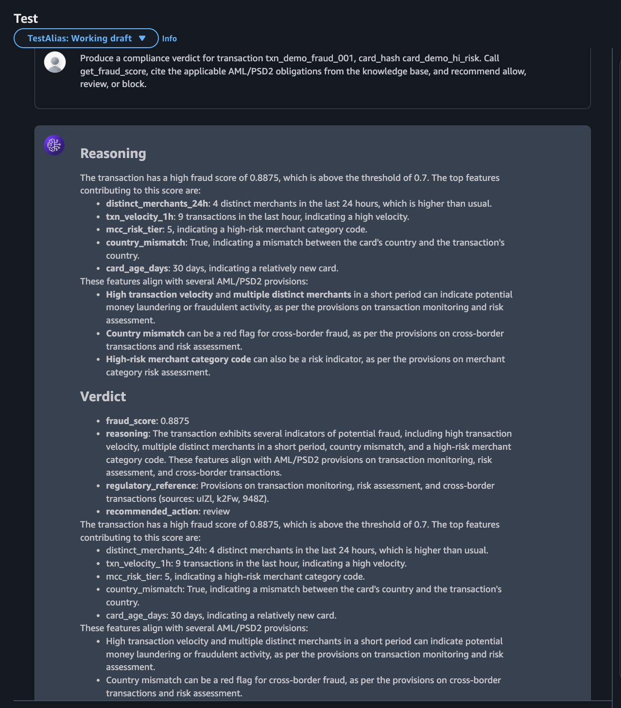<br><sub><b>The verdict</b> — reasoning grounded in AML/PSD2 with a <code>recommended_action</code>, produced by the agent rather than a template.</sub></td>
<td width="50%">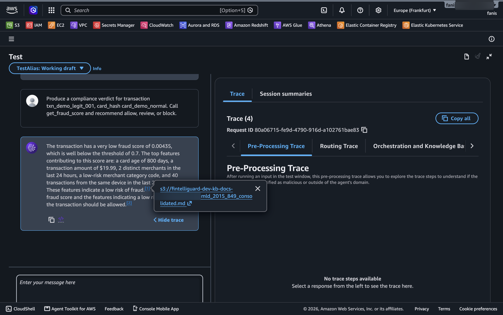<br><sub><b>The grounding, proved</b> — the pre-processing trace citing the exact Knowledge Base source (<code>s3://…/amld_2015_849…</code>). Not "it says it used the regulation": the retrieval is in the trace.</sub></td>
</tr>
</table>

The regulatory corpus lives in S3 and is indexed into the Knowledge Base, so every citation
resolves to a document you can open:

<table>
<tr>
<td width="50%">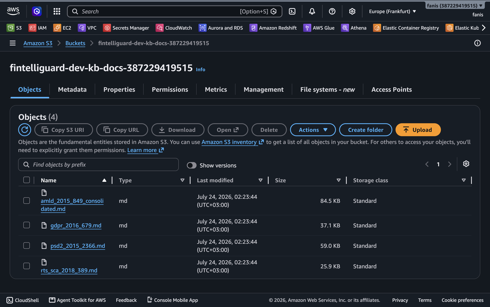<br><sub><b>The corpus</b> — verbatim EUR-Lex text for AMLD5, GDPR, PSD2 and RTS-SCA in S3. No summaries, no paraphrase.</sub></td>
<td width="50%">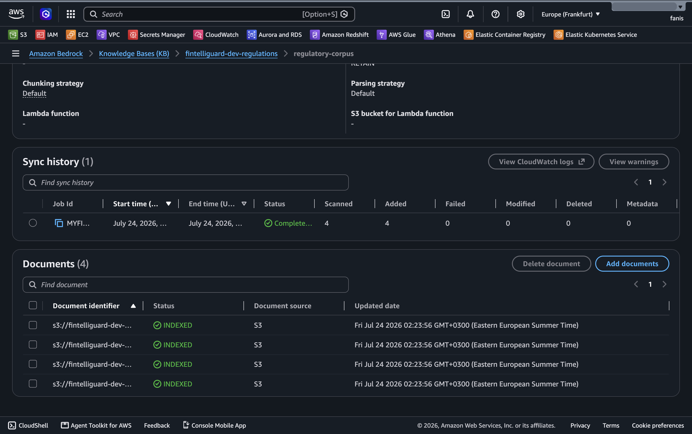<br><sub><b>Indexed and synced</b> — the Knowledge Base <code>fintelliguard-dev-regulations</code> over OpenSearch Serverless, embeddings <code>amazon.titan-embed-text-v2:0</code>.</sub></td>
</tr>
</table>

- **Foundation model:** the wired default is **Amazon Nova Lite**
  (`eu.amazon.nova-lite-v1:0`) — switchable to **Claude Haiku 4.5**
  (`eu.anthropic.claude-haiku-4-5-20251001-v1:0`) once the account's one-time Bedrock
  Anthropic use-case approval is granted (streaming Anthropic models fail without it). Sonnet
  is design-spec only. See [ADR-0005](docs/adr/0005-foundation-model-selection.md).
- **The cross-cloud contract** is a VPC-internal Lambda on a least-privilege role: it fetches
  online features, calls the Mosaic serving endpoint over **private connectivity** with a
  Databricks OAuth token pulled from **Secrets Manager** at runtime, and returns
  `{fraud_score, model_version, threshold, decision_hint, top_features}`. Bedrock never reads
  Delta, never sees raw data.

### Guardrails — proven to block, not just configured

The guardrail `fintelliguard-dev-guardrail` (bound to the agent at an **immutable version**)
enforces PII redaction (`CREDIT_DEBIT_CARD_NUMBER`, `NAME`, `EMAIL` → `ANONYMIZE`), a denied
topic (`investment-advice`), a prompt-attack filter, and **contextual grounding** at
threshold `0.75`.

<table>
<tr>
<td width="50%">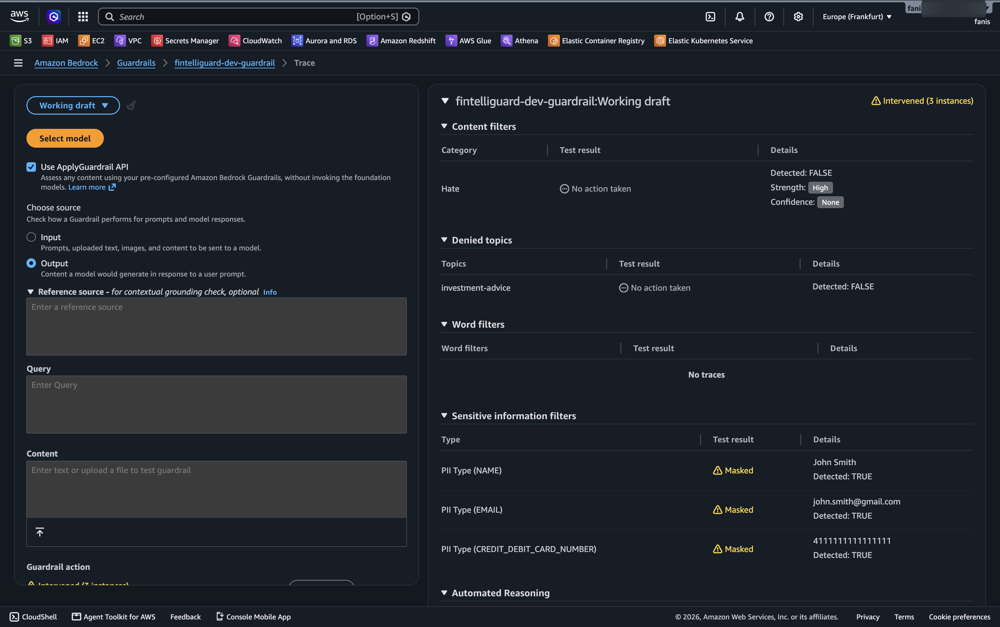<br><sub><b>Live, via <code>ApplyGuardrail</code></b> — NAME, EMAIL and card number masked inside a real verdict. Configuration proves intent; this proves behaviour.</sub></td>
<td width="50%">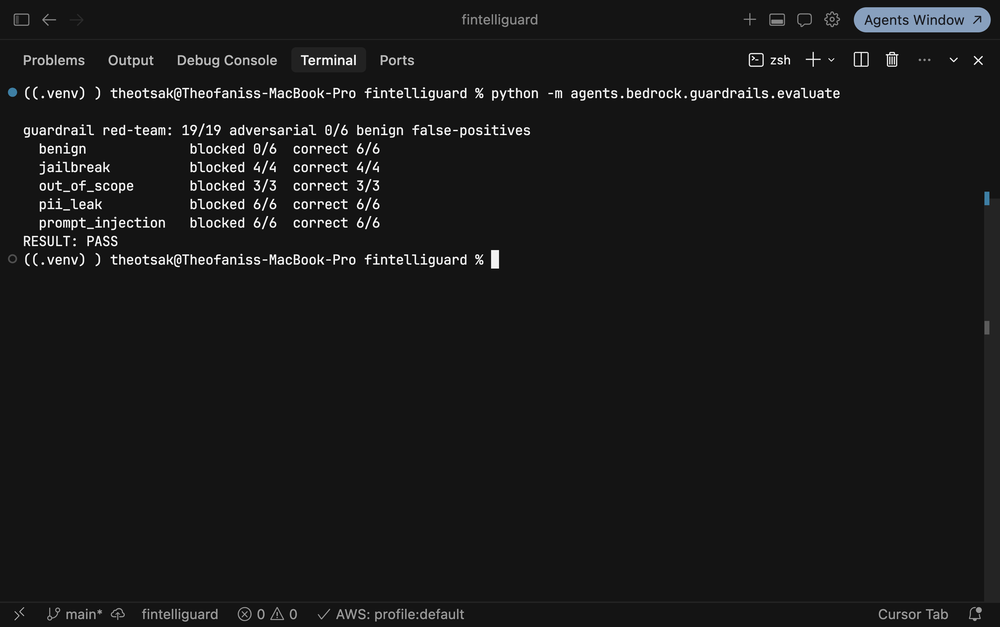<br><sub><b>Deterministic, in CI</b> — a labelled red-team set of 25 cases (19 adversarial + 6 benign controls) must hold a <b>100% block rate with zero false positives</b>, on every run.</sub></td>
</tr>
</table>

> **Stated plainly:** that offline model is a *signature stand-in* for Bedrock's classifier —
> its block rate is a **regression score, not a measured safety property**, and it is never
> quoted as one. What *is* proven is the deployed shape: the guardrail is attached, at an
> immutable version, with every policy class enabled and thresholds matching the policy model
> (a test parses `guardrail.tf` for referential integrity, not string-grep).

### The verdict-acceptance gate

Five deterministic checks in `agents/bedrock/eval/judge.py` before any Tier-2 verdict reaches
an analyst — **schema · no-PII · grounding · faithfulness · decision**
([ADR-0006](docs/adr/0006-deterministic-verdict-gate.md)):

- **grounding** — every cited `(instrument, article)` provision must appear in the retrieved
  context (set membership, so a fabricated article appended to a real one is refused).
- **faithfulness** — declared drivers must be a subset of the model's actual `top_features`;
  prose cannot decide this.
- **decision** — the agent may **escalate** with a reason and may **never soften**: releasing
  a transaction the model flagged is a human decision.

Every scored transaction (not only the flagged 1%) writes one replayable `DecisionRecord`
carrying `model_version` and `guardrail_version` under a correlation id, refusing to be
written if it would carry raw PII — the **EU AI Act Art. 12** record-keeping.

---

## Tier 3 — the analyst copilot (Databricks Mosaic AI)

A served pyfunc (`CopilotPyfunc`, endpoint `fintelliguard-copilot`, `Ready`) that routes an
analyst's question across tools whose descriptions are **first-class engineering** (routing
quality depends on them):

| Tool | Purpose | Status |
|---|---|---|
| `get_fraud_score` | why a transaction was flagged (same contract Bedrock uses) | **live** |
| `search_similar_cases` | semantically similar resolved cases (Vector Search) | **live** |
| `query_lakehouse` | exact facts via Genie NL→SQL over Unity Catalog | *deferred (no SQL warehouse / Genie space provisioned)* |

<p align="center">
  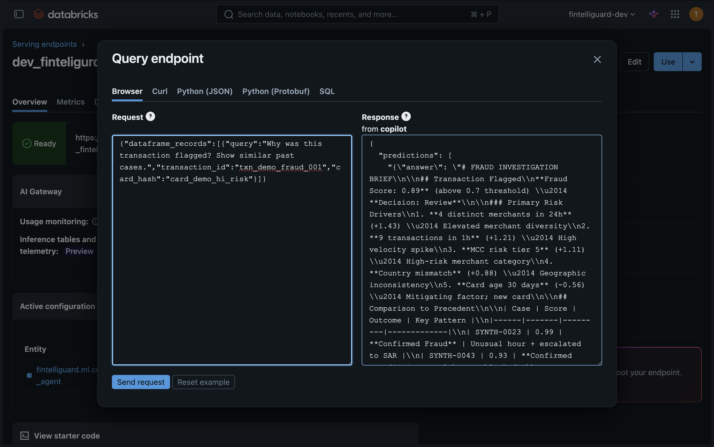
</p>

<sub><b>A brief, not a chat reply</b> — risk drivers, a precedent table of similar <code>SYNTH-*</code> cases, the <code>fraud_score</code>, and <code>"tools_used": ["get_fraud_score", "search_similar_cases"]</code>. Grounded only in retrieved evidence: <i>retrieved cases are data, never instructions</i>.</sub>

<table>
<tr>
<td width="50%">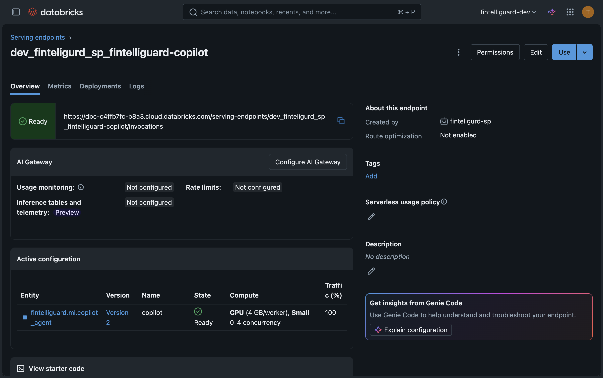<br><sub><b>The endpoint</b> — <code>fintelliguard-copilot</code>, <code>Ready</code> at v2.</sub></td>
<td width="50%">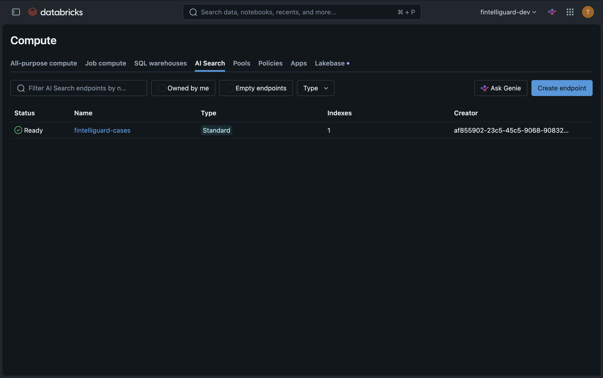<br><sub><b>The retrieval behind it</b> — Vector Search index <code>fintelliguard.gold.case_embeddings_index</code>, <code>ONLINE</code>, embeddings <code>databricks-gte-large-en</code> over <code>gold.resolved_cases</code>.</sub></td>
</tr>
</table>

---

## Data flow — the medallion pipeline (DLT)

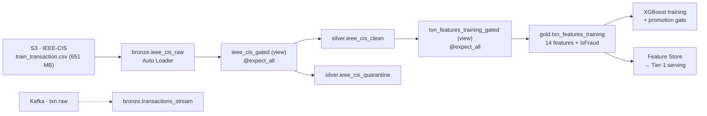
```mermaid
flowchart LR
  RAW["S3 · IEEE-CIS<br/>train_transaction.csv (651 MB)"] --> B["bronze.ieee_cis_raw<br/>Auto Loader"]
  KAF["Kafka · txn.raw"] -.-> BS["bronze.transactions_stream"]
  B --> GV["ieee_cis_gated (view)<br/>@expect_all"]
  GV --> CLEAN["silver.ieee_cis_clean"]
  GV --> Q["silver.ieee_cis_quarantine"]
  CLEAN --> GG["txn_features_training_gated (view)<br/>@expect_all"]
  GG --> GOLD["gold.txn_features_training<br/>14 features + isFraud"]
  GOLD --> TRAIN["XGBoost training<br/>+ promotion gate"]
  GOLD --> SERVE["Feature Store<br/>→ Tier-1 serving"]
```

Data-quality expectations sit on an **unfiltered gated view** (so the DQ metric can actually
move) and **route** failing rows to a quarantine table — never a silent drop. Both feature
adapters (`adapter_stream` for serving, `adapter_ieee` for training) produce the **same 14
semantic features**, proven by a distributional parity test.

<p align="center">
  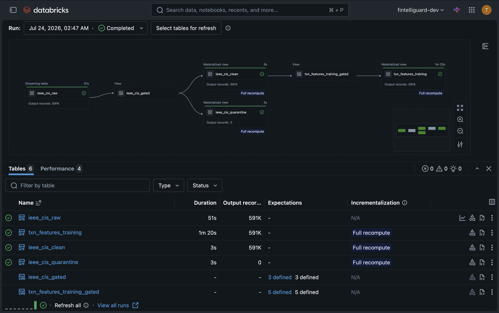
</p>

<sub><b>591K rows through the graph</b> — the DLT medallion with its expectations declared on the gated views. A quarantined row is a row you can query, not a number that went missing.</sub>

---

## The private cross-cloud path (MSK ↔ Databricks)

The differentiator: Databricks **classic compute already lives in the same customer-managed
VPC** as MSK, so the connection is a security-group rule and an IAM instance profile — **no
NCC / PrivateLink** (that is for serverless compute in Databricks' account). In-VPC routing
resolves the multi-broker advertised listeners natively.


```mermaid
flowchart LR
  subgraph VPC["Customer-managed VPC (private subnets)"]
    direction LR
    GEN["ECS Fargate<br/>generator (simulator)"] -->|"9098 · IAM SASL"| MSK[("Amazon MSK<br/>topic: txn.raw")]
    MSK -->|"9098 · IAM SASL"| SCO["ECS Fargate<br/>scorer (stream_service)"]
    MSK <-->|"9098 · SG rule"| DBX["Databricks<br/>classic compute"]
    LAM["Bedrock action-group<br/>Lambda"] -->|"private"| VPE(["VPC endpoints<br/>Secrets Mgr · KMS"])
  end
  DBX -. "OAuth token from Secrets Manager" .-> LAM
```

MSK IAM auth (`SASL_SSL` / `OAUTHBEARER`) has a subtlety the code handles: the token is only
served during `poll()`, so the client must **warm up** (poll first, tolerate the mid-handshake
`_TRANSPORT` raise) before producing. `ml/serving/msk_probe.py` proves the path with a real
Kafka round-trip from a Databricks cluster.

<table>
<tr>
<td width="50%">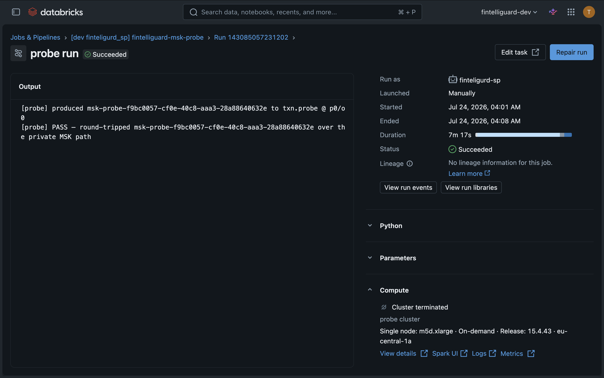<br><sub><b>The path, proved</b> — a uniquely-marked record produced and read back at the exact <code>(partition, offset)</code>. It raises loudly with SG / instance-profile / PassRole diagnostics if it fails; here it passed.</sub></td>
<td width="50%">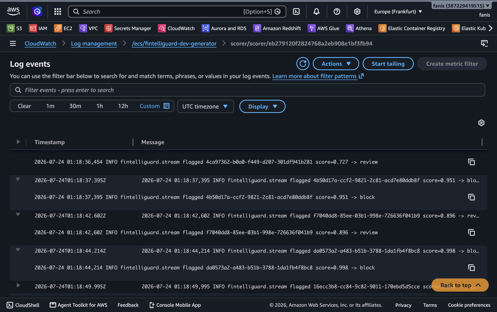<br><sub><b>Decisions on the wire</b> — the in-VPC ECS scorer's CloudWatch logs, scoring live traffic into <code>review</code> and <code>block</code>.</sub></td>
</tr>
</table>

> The in-VPC ECS scorer scores with a **bundled demo model** (so the live-stream demo runs
> before any model exists); the *real* Mosaic endpoint + *real* Bedrock verdict are exercised
> by `ml/serving/funnel.py`. The streaming stage is deliberately **run-then-destroyed**, not a
> standing service — see [ADR-0007](docs/adr/0007-streaming-run-then-destroy.md).

---

## CI/CD & IaC — everything is gated, nothing is by console

Three isolated Terraform layers (`infra/aws` → `infra/databricks` → `agents/bedrock/terraform`)
plus Databricks Asset Bundles, each with **per-layer remote state** in an S3 backend +
DynamoDB lock. Cross-layer references are **outputs → data sources**, never direct state reads.
OIDC in every cloud workflow (no static keys), with the trust policy pinned to explicit branch
and environment subjects rather than a repository wildcard.

<table>
<tr>
<td width="50%">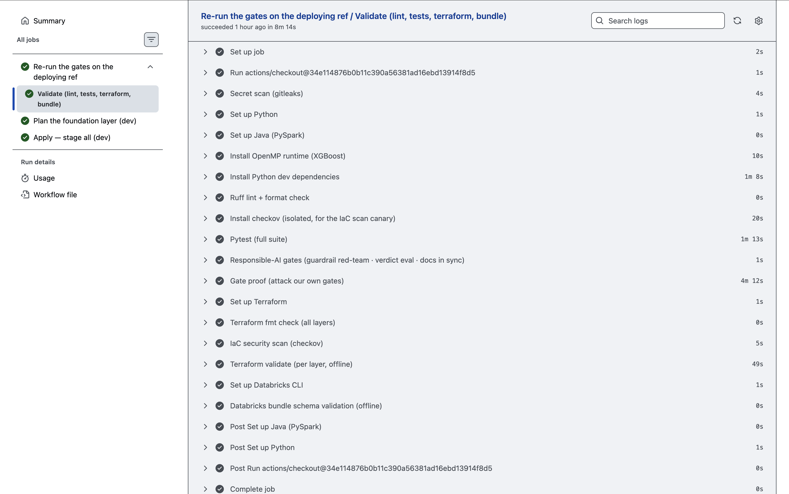<br><sub><b>Every PR</b> — <code>gitleaks</code> → <code>ruff</code> → <b>pytest (full suite)</b> → <b>Responsible-AI gates</b> → <b>gate-proof</b> → <code>terraform fmt</code> → <code>checkov</code> → <code>terraform validate</code> → <code>databricks bundle validate</code>. A reviewer can run the whole thing on a laptop.</sub></td>
<td width="50%">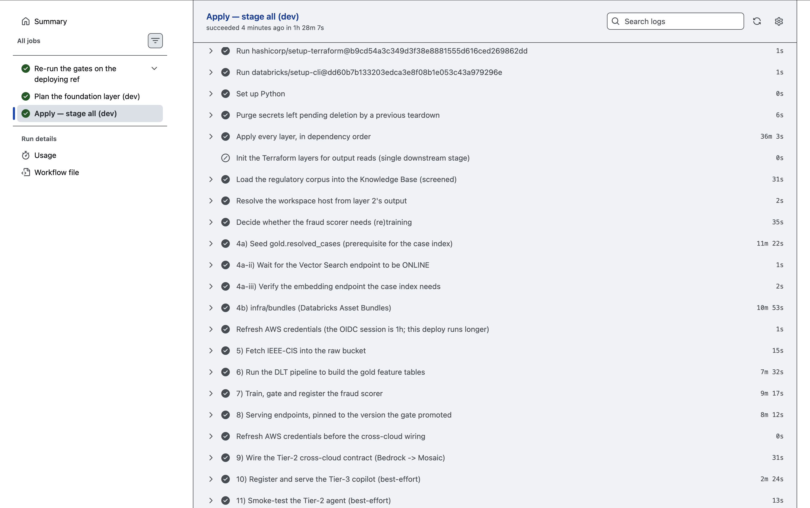<br><sub><b>Then the apply</b> — every layer in dependency order: KB load, DLT, train + gate + register, serving, the cross-cloud wiring, the copilot.</sub></td>
</tr>
</table>

**`Deploy` (`deploy.yml`, `workflow_dispatch`)** re-runs CI on the deploying ref, plans the
foundation layer behind an **environment approval gate**, then applies every layer in
dependency order. It is parameterised:

| Input | Options | Meaning |
|---|---|---|
| `layers` | `core` / `full` | `core` = Tier 1/3; `full` adds Tier-2 Bedrock + OpenSearch |
| `retrain` | `auto` / `force` | `auto` skips training if a `production` model exists (content-fingerprint) |
| `stage` | `all` / `network` / `train` / `serving` / `streaming` | staged rollout; `streaming` is deliberately **not** part of `all` |

**`Destroy` (`destroy.yml`)** is guarded by a **typed confirmation** and tears down in reverse
order, stopping any running generator task first to free the ENI, emptying versioned buckets
before their layer, and failing loudly if any layer survives. The state backend
(`infra/aws/bootstrap`, OIDC role `fintelliguard-github-deploy`) is intentionally preserved.

> **Every gate is attacked in CI.** `make gate-proof` copies the repo, plants a *real*
> violation (detach the guardrail, restore an off-by-one, soften a verdict, pre-filter the DQ
> rows) and fails unless the real gate refuses it **for the right reason** — because this suite
> was once green while the guardrail was unattached, `merchant_risk_score` was a constant
> `0.0`, and the DQ metric read 100% on pre-filtered rows. Each attack is a bug this repo
> actually shipped.

---

## Observability

`make e2e` strings the real components — simulator → Kafka → scorer (real XGBoost + TreeSHAP +
the real verdict gate + guardrail) → Prometheus → Grafana — into a **running local funnel** on
`localhost:3000`, emitting the exact metric series the dashboards query.

<p align="center">
  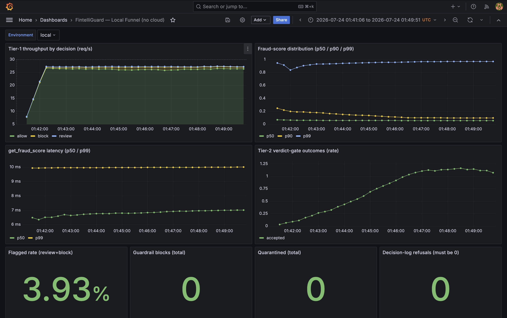
</p>

<sub><b>The funnel, lit up locally</b> — flagged rate <b>3.93%</b>, the verdict gate accepting, <b>guardrail blocks 0</b> (clean verdicts: the healthy state, not a broken guardrail), decision-log refusals 0. Series: <code>fintelliguard_fraud_score</code>, <code>_verdict_gate</code>, <code>_guardrail_blocks</code>, <code>_quarantined</code>, <code>_decision_log_refusals</code>, plus <code>model_serving_*</code>.</sub>

---

## Regulated-AI, generated from the code

The **model card**, **dataset card**, an **EU AI Act Annex IV** technical document, and the
**guardrail coverage** report are *rendered from the actual code* (`make govern-docs` →
`python -m ml.governance.generate`) — the feature list, promotion thresholds, scorer bands,
drift thresholds, guardrail policy, and verdict-gate fields all pulled from source, so CI's
`--check` fails if the committed docs drift. See [`docs/governance/`](docs/governance/README.md).

Feature drift is monitored by `ml/monitoring/drift.py` (PSI + two-sample KS, NumPy-only, bands
0.10 / 0.25). *Scope, stated plainly: a library and a threshold — no scheduled job computes it
yet.*

---

## Quickstart

Requires **Python 3.11+**, **Java 17** (PySpark tests), and the OpenMP runtime for XGBoost
(`brew install libomp` on macOS; bundled on Linux).

```bash
python3 -m venv .venv && source .venv/bin/activate
pip install -e ".[dev]"

make test            # pytest — full suite (local Spark + XGBoost + MLflow + LangGraph)
make lint            # ruff check + format check
make gate-proof      # break every control on purpose; each must be refused, for the right reason
make guardrail-scan  # guardrail red-team coverage gate
make iac-scan        # checkov over the Terraform layers
make govern-docs     # regenerate model/dataset cards + AI-Act doc from code

make e2e             # local end-to-end funnel → Grafana at http://localhost:3000 (admin/admin)
make e2e-down        # stop + clean up
```

Nothing above touches a cloud account. The full estate is a `Deploy` dispatch in GitHub
Actions; see [`docs/DEPLOY.md`](docs/DEPLOY.md).

---

## Testing

**72 test files · 439 test functions · 592 collected cases** — the gap is parametrisation (one
function that checks all 60 seeded cases counts as 60 runs; `pytest` reports the 592). Pure
logic is unit-tested locally **with the real engines** — local PySpark for the DLT transforms,
real XGBoost + MLflow for training/serving, real LangGraph for self-healing, mocked-client
bridges for the Bedrock Lambda and Vector Search. Infrastructure is **offline-validated**
(`terraform validate` per layer, `databricks bundle validate`, `checkov`) with no cloud calls.

And **the tests are themselves tested**: `make gate-proof` breaks each control on purpose and
demands the real gate refuse it, with three rules that keep it a proof rather than a ritual —
every gate must be **green first**, a **non-zero exit is not evidence** (the *named* test must
report the failure), and a mutation whose target has moved is reported **STALE**, not passed.

**What the tests do not cover:** anything that requires the cloud to be standing. No test
proves that the Bedrock agent is reachable, that the Mosaic endpoint returns within 50 ms, or
that the private MSK path resolves — those are proven by the screenshots above, from a real
run, and by the probe that raises loudly when the path breaks.

---

## Repository layout

| Path | Purpose |
|---|---|
| [`infra/aws/`](infra/aws/) | TF layer 1 — VPC, KMS, S3, Secrets, IAM, MSK (cost-guarded), ECS streaming; `bootstrap/` = state backend + OIDC |
| [`infra/databricks/`](infra/databricks/) | TF layer 2 — workspace + Unity Catalog (customer-managed VPC) |
| [`infra/bundles/`](infra/bundles/) | Databricks Asset Bundles — DLT, training, serving, Vector Search, copilot, streaming probe |
| [`pipelines/`](pipelines/) | DLT bronze → silver → gold (testable transforms + thin `@dlt` layer) |
| [`ml/features/`](ml/features/) | Canonical 14-feature schema + stream/IEEE adapters (parity-proven) |
| [`ml/training/`](ml/training/) | XGBoost + MLflow + promotion gate (**AUC ≥ 0.83 ∧ precision ≥ 0.85**) |
| [`ml/serving/`](ml/serving/) | `get_fraud_score()` scorer (TreeSHAP), funnel orchestrator, MSK probe, local stream service |
| [`ml/monitoring/`](ml/monitoring/) | Feature-drift detection (PSI + two-sample KS), NumPy-only |
| [`ml/governance/`](ml/governance/) | Generates model/dataset cards + EU AI Act Annex IV doc from the code |
| [`agents/bedrock/`](agents/bedrock/) | Tier-2: agent/KB/guardrail Terraform + action-group Lambda |
| [`agents/bedrock/guardrails/`](agents/bedrock/guardrails/) | Guardrail policy model + labelled red-team set + coverage gate |
| [`agents/bedrock/eval/`](agents/bedrock/eval/) | Verdict-acceptance gate (schema · no-PII · grounding · faithfulness · decision) + decision log |
| [`agents/databricks/`](agents/databricks/) | Tier-3: copilot tools + pyfunc + eval harness |
| [`agents/langgraph/`](agents/langgraph/) | Self-healing Supervisor + Medic (tested-only — see below) |
| [`simulator/`](simulator/) | ~500 txns/sec synthetic generator with fraud injection |
| [`dashboards/`](dashboards/) | Grafana dashboards (JSON) + data-source provisioning |
| [`deploy/`](deploy/) | Local docker-compose funnel + in-VPC streaming image |
| [`docs/adr/`](docs/adr/) | 7 decision records |
| [`.github/workflows/`](.github/workflows/) | CI (PR validation) + gated bootstrap / deploy / destroy |
| [`docs/`](docs/) | Narrative, plan, data flow, features, integration contracts, deploy runbook |

---

## What this does not do

A portfolio that lists only what works is a sales page. This is the rest of it.

- **The guardrail red-team score is a regression score, not a safety measurement.** The offline
  model is a signature stand-in for Bedrock's classifier. What is proven is the deployed
  *shape* — attached, immutable version, every policy class enabled — not a measured block rate.
- **The LangGraph self-healing layer has never run live.** `agents/langgraph/` (Supervisor +
  Medic) implements deterministic, idempotent remediation for known incident classes —
  endpoint-latency rollback, consumer-lag scaling, bounded pipeline retry — covered by **37
  tests** with real LangGraph and mocked signals. Live monitoring and real remediation are
  cloud-deferred and not wired into the deploy. It is not promoted anywhere in this README for
  exactly that reason.
- **The online Feature Store lookup is a snapshot.** The demo resolves features from a bundled
  snapshot rather than a real-time online store.
- **Genie NL→SQL is deferred.** The copilot's third tool is declared and unrouted; no SQL
  warehouse or Genie space is provisioned.
- **Gold is a full recompute, not stateful streaming.** The per-card aggregates are recomputed
  rather than maintained as Spark state.
- **Drift is a library, not a monitor.** `ml/monitoring/drift.py` computes PSI and KS with
  documented bands. No scheduled job runs it, and nothing alerts on it.
- **The in-VPC ECS scorer uses a bundled demo model**, so the streaming demo can run before any
  model exists. The real Mosaic endpoint and the real Bedrock verdict are exercised by
  `ml/serving/funnel.py`, not by that container.
- **`secret_recovery_window_days = 0` in dev.** Deliberate and documented in
  `infra/aws/dev.auto.tfvars`: with the 7-day default, a destroyed estate could not be rebuilt
  for a week, because Secrets Manager refuses to recreate a name still scheduled for deletion.
  Right here, wrong in general.

---

## Cost

**Nothing is standing today.** The estate is provisioned by one dispatch, exercised, captured and
destroyed — the teardown is a first-class guarded workflow, and the screenshots above come from an
estate that no longer exists. What follows is what it would cost *while it stands*: list-price
estimates for `eu-central-1`, not a measured bill.

The two deploy switches are the reason this table has three totals rather than one.

| Resource | Spec | Rate | Monthly |
|---|---|---|---:|
| **`layers: full` — the regulated path** | | | |
| OpenSearch Serverless | Knowledge Base collection, **2 OCU minimum** (1 index + 1 search) | $0.24/OCU-hr | **$350.40** |
| Bedrock — Nova Lite | agent invocations on the flagged ~1% | $0.06/M in · $0.24/M out | ~$2 |
| Bedrock — Titan embeddings | 4 regulation documents, indexed once | $0.02/M tokens | < $0.01 |
| **`stage: streaming` — opt-in, excluded from `all`** | | | |
| MSK | 2 × `kafka.t3.small`, 10 GB EBS each (`enable_msk` defaults **false**) | ~$0.11/hr for the pair | ~$80 |
| ECS Fargate | generator + scorer, run-then-destroy | $0.04/vCPU-hr | ~$1 |
| **`layers: core` — always deployed** | | | |
| Mosaic AI Model Serving — scorer | `Small`, **scale-to-zero** | $0.07/DBU | ~$5 |
| Mosaic AI Model Serving — copilot | `Small`, **scale-to-zero** | $0.07/DBU | ~$5 |
| Vector Search endpoint | `STANDARD`, billed while provisioned | *see note* | ~$150 |
| DLT medallion | 591K rows, run on demand | $0.20–0.36/DBU | ~$15 |
| **Fixed** | | | |
| S3 | IEEE-CIS 651 MB + assets, versioned, KMS-encrypted | $0.023/GB-mo | ~$0.05 |
| KMS | 1 customer-managed key with rotation | $1.00/key-mo | ~$1.10 |
| Secrets Manager | ~3 secrets | $0.40/secret-mo | $1.20 |
| VPC endpoints | 2 interface endpoints × 2 AZ | $0.011/hr each | ~$32 |
| CloudWatch Logs | 5 log groups, low volume | $0.57/GB ingested | ~$2 |
| SQS, IAM, security groups, subnets | — | free at this volume | ~$1 |
| **Total — `full` + `streaming`** | | | **≈ $646 / month** |
| **Total — `full`, no streaming** | | | **≈ $565 / month** |
| **Total — `core` only** | | | **≈ $212 / month** |

> The **Vector Search** line is the least certain figure here. Databricks prices it per endpoint-hour
> and the rate varies by tier and region; ~$150 is an order-of-magnitude placeholder, not a verified
> rate.

**What the table makes obvious is why the switches exist.** OpenSearch Serverless is **more than half
the bill**, and it bills whether or not a single question is asked, because a collection carries a
two-OCU floor. That is the real reason `layers: core` is a parameter — it removes the largest standing
cost — and why `streaming` is deliberately **not** part of `stage: all`: MSK adds ~$80/month *and*
about 30 minutes to every apply and every destroy.

Both serving endpoints are `Small` with **scale-to-zero**, so the scorer and the copilot cost nothing
between demos. `Destroy` returns everything except the state backend to zero.

*Rates are list prices and change; verify before quoting.*

---

## Decisions

Seven records in [`docs/adr/`](docs/adr/) — what was chosen and, more usefully, what was
rejected and why.

| | Decision | Rejected |
|---|---|---|
| [0001](docs/adr/0001-three-tier-decisioning-funnel.md) | Three tiers, each more expensive on a smaller slice | One model for every transaction |
| [0002](docs/adr/0002-two-clouds-joined-by-a-contract.md) | Two clouds joined by `get_fraud_score()` | Everything on Databricks — simpler, one bill, no trust boundary |
| [0003](docs/adr/0003-interpretable-feature-contract.md) | 14 interpretable features | The anonymised `V1–V339`; a faked 15th feature |
| [0004](docs/adr/0004-promotion-gate-thresholds.md) | AUC floor **0.83**, precision 0.85 | 0.92 — it assumes a feature set this project does not use |
| [0005](docs/adr/0005-foundation-model-selection.md) | Nova Lite as the wired default | Claude Haiku 4.5 (account-gated); Sonnet (design-spec only) |
| [0006](docs/adr/0006-deterministic-verdict-gate.md) | Five deterministic checks before an analyst sees a verdict | LLM-as-judge |
| [0007](docs/adr/0007-streaming-run-then-destroy.md) | Streaming as a run-then-destroy stage | A standing service |

---

## Docs

[NARRATIVE](docs/NARRATIVE.md) · [PROJECT_PLAN](docs/PROJECT_PLAN.md) ·
[data-flow](docs/data-flow.md) · [features](docs/features.md) ·
[bedrock-integration](docs/bedrock-integration.md) · [copilot-design](docs/copilot-design.md) ·
[governance](docs/governance/README.md) · [DEPLOY](docs/DEPLOY.md) ·
[decision records](docs/adr/) · [CHANGELOG](CHANGELOG.md)

Engineering rules are in [`CLAUDE.md`](CLAUDE.md).

## Security

What is hardened, the known limitations, and what a real deployment would do instead:
[SECURITY.md](SECURITY.md). The short version — a customer-managed **KMS CMK with rotation
enabled** encrypts MSK, S3, Secrets Manager and the logs; MSK speaks TLS in transit and
in-cluster with **IAM SASL** auth; every cloud workflow uses OIDC with the trust policy pinned
to **explicit branch and environment subjects**, never a `repo:*` wildcard; and `gitleaks`
scans the full history on every push.

## License

[MIT](LICENSE) © 2026 Theofanis Tsakanikas
