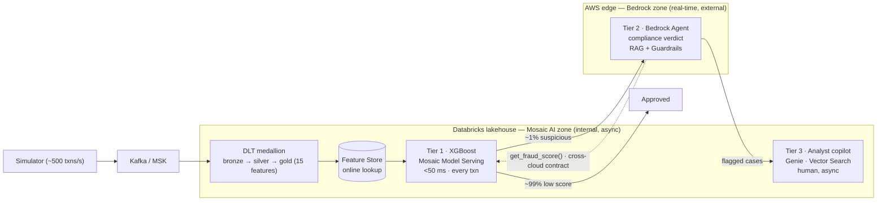

# FintelliGuard

[](https://github.com/theofanis-tsakanikas/fintelliguard/actions/workflows/ci.yml)

**Real-time financial fraud detection & compliance platform.**
*AWS Bedrock · Databricks Mosaic AI · Kafka/MSK · Spark · Terraform · LangGraph*

## The problem

Card-fraud systems fail on two fronts at once. Rule engines flag transactions *after*
approval, so losses are booked before an analyst opens the case. And AML/PSD2 require a
**documented, regulation-grounded justification for every flagged transaction** — work a
mid-size bank throws 40–80 analysts at. FintelliGuard scores every transaction in under
50 ms, auto-drafts a regulation-grounded compliance verdict for the suspicious ~1%, and
gives analysts an AI copilot to investigate the rest — attacking fraud latency and
compliance cost in one system.

## Architecture — three-tier decisioning, two-zone GenAI

A transaction flows through a funnel where each tier is more expensive and runs on a
smaller slice. The two GenAI zones live in their natural homes and are joined by a
**contract, not coupling**: Bedrock reaches the model only through `get_fraud_score()`.



- **Tier 1 — XGBoost on Mosaic AI Model Serving.** Scores 100% of transactions in
  <50 ms; ~99% pass and are done. The fast, numeric decision.
- **Tier 2 — AWS Bedrock Agent.** Only the suspicious ~1%. Calls back for the score via
  `get_fraud_score()`, grounds a compliance verdict in AML/PSD2 via RAG, and passes it
  through Guardrails. The slow reasoning layer — never the scorer.
- **Tier 3 — Databricks Mosaic AI copilot.** Human analysts investigate flagged cases
  asynchronously with NL→SQL (Genie), semantic retrieval (Vector Search), and the same
  `get_fraud_score()`. Decision support, not automation.

See [`docs/NARRATIVE.md`](docs/NARRATIVE.md) for the *why*, and
[`docs/PROJECT_PLAN.md`](docs/PROJECT_PLAN.md) for the full component inventory.

## Stack

| Layer | Technology |
|---|---|
| Ingestion (streaming) | Kafka / AWS MSK → Spark Structured Streaming |
| Ingestion (batch) | S3 → Databricks Auto Loader |
| Data platform | Databricks DLT · Unity Catalog · Delta Lake |
| ML training | XGBoost · MLflow · Mosaic AI Feature Store |
| ML serving | Mosaic AI Model Serving (REST, autoscale) |
| Real-time AI (Tier 2) | AWS Bedrock Agent · Knowledge Bases · Guardrails · Claude (Haiku 4.5 → Sonnet 4.6) |
| Investigation AI (Tier 3) | Mosaic AI Agent Framework · Vector Search · Genie · Agent Evaluation |
| Self-healing | LangGraph Supervisor + Medic · LangSmith tracing |
| IaC | Terraform (3 isolated layers) · Databricks Asset Bundles |
| CI/CD | GitHub Actions |
| Observability | Grafana · Prometheus · LangSmith |

## Engineering highlights

- **Feature parity by construction.** One canonical 15-feature schema; two adapters
  (stream + IEEE-CIS) that *must* produce it. A single source of truth eliminates
  training-serving skew — proven by an end-to-end test that compares both adapters.
- **No target leakage, proven.** Window/state features use only transactions strictly
  *before* the current one; a test feeds a future-dated event and asserts it is ignored.
- **Cross-cloud contract fidelity.** The Bedrock action-group Lambda's output equals the
  `ml/serving` scorer's output byte-for-byte — asserted in tests, so the two clouds stay
  in sync through the contract.
- **Per-prediction explanations.** `top_features` are exact **TreeSHAP** contributions
  (XGBoost `pred_contribs`) — *why this transaction* scored as it did, not global
  importance — feeding the agent's regulated reasoning.
- **Self-healing.** A LangGraph Supervisor + Medic classifies health signals and applies
  deterministic, **idempotent** remediation (endpoint p99 > 200 ms → roll back to the
  previous model version; lag → scale; pipeline failure → retry-then-escalate).
- **Security by default.** Least-privilege IAM (no authored wildcards), customer-managed
  KMS, private VPC endpoints for the cross-cloud call, secrets only in AWS Secrets
  Manager / Databricks secret scopes, and **Guardrails** (PII redaction + grounding) on
  every regulated verdict.
- **Proven guardrails, not just configured.** A labelled **red-team set** (prompt-injection,
  jailbreak, out-of-scope, PII-leak) is run against the guardrail policy in CI — 16/16
  adversarial probes blocked, 0 benign false positives — and the test parses `guardrail.tf`
  so removing a policy class fails the build.
- **Verdict acceptance gate.** Every Tier-2 compliance verdict passes five deterministic
  checks before reaching an analyst — schema, no raw PII, **grounding** (cited regulations
  must exist in the retrieved context), **faithfulness** (drivers must be the model's actual
  `top_features`), and decision consistency. The hard floor under the LLM.
- **Drift-monitored.** PSI + two-sample KS per feature with alert thresholds catch silent
  distribution shift before it degrades the score.
- **Regulated-AI docs generated from the code.** Model card, dataset card, and an
  **EU-AI-Act Annex IV** technical document are rendered from the actual features,
  thresholds, and guardrail coverage — CI fails if they drift. See
  [docs/governance/](docs/governance/README.md).
- **IaC only.** Three isolated Terraform layers with per-layer remote state + Databricks
  Asset Bundles. No console deployments.
- **199 local tests**, green in CI on every PR.

## Testing philosophy (honest)

Pure logic is **unit-tested locally with the real engines** — local **PySpark** for the
DLT transforms and dashboard SQL, real **XGBoost + MLflow** for training/serving, real
**LangGraph** for self-healing, real mocked-client bridges for the Bedrock Lambda and
Vector Search. The **Responsible-AI gates are tested too**: the guardrail red-team
(adversarial probes must be blocked, benign ones must not), the verdict acceptance gate
(each adversarial verdict rejected on the right check), the drift detector, and the
generated AI-Act docs (`--check` must match the code). Infrastructure is
**offline-validated** (`terraform validate` per layer, `databricks bundle validate`
schema) with no cloud calls. **Cloud execution is deferred** to a dedicated deploy phase —
see [`docs/DEPLOY.md`](docs/DEPLOY.md). A reviewer can clone this repo and run the entire
suite on a laptop.

## Business impact

Conservative estimates from **published industry benchmarks on synthetic data** — they
demonstrate the mechanism, **not measured production results**. Full context in
[`docs/NARRATIVE.md`](docs/NARRATIVE.md).

| Metric | Baseline | With FintelliGuard |
|---|---|---|
| Fraud detection latency | 2–4 h (batch) | < 50 ms |
| Compliance review per case | 45 min | ~3 min |
| False positive rate | ~8% | ~3% |
| Compliance analyst FTE | 40–80 | 10–20 (oversight) |

## Project status

**Built · locally validated · deploy-ready — not currently deployed.** Every layer is
implemented, the full test suite passes locally and in CI, and all infrastructure is
offline-validated. Provisioning real cloud resources is deliberately deferred (it incurs
cost); the ordered runbook is in [`docs/DEPLOY.md`](docs/DEPLOY.md). Nothing here claims a
running production system — but it is engineered to deploy from this state.

## Run the tests locally

Requires **Python 3.11+**, **Java 17** (for the PySpark tests), and the
OpenMP runtime for XGBoost (`brew install libomp` on macOS; bundled on Linux).

```bash
python3 -m venv .venv && source .venv/bin/activate
pip install -e ".[dev]"

make test            # pytest — full suite (local Spark + XGBoost + MLflow + LangGraph)
make lint            # ruff check
make fmt             # ruff format
make guardrail-scan  # run the guardrail red-team coverage gate
make govern-docs     # regenerate the model/dataset cards + AI-Act technical docs
```

Offline-validate the infrastructure (no cloud creds needed):

```bash
terraform -chdir=infra/aws validate          # after: terraform -chdir=infra/aws init -backend=false
cd infra/bundles && databricks bundle validate -t dev
```

## Repository layout

| Path | Purpose |
|---|---|
| [`infra/aws/`](infra/aws/) | TF layer 1 — VPC, KMS, S3, Secrets, IAM, MSK (cost-guarded); `bootstrap/` = state backend |
| [`infra/databricks/`](infra/databricks/) | TF layer 2 — workspace + Unity Catalog (customer-managed VPC) |
| [`infra/bundles/`](infra/bundles/) | Databricks Asset Bundles — DLT, serving, Vector Search, agent, grants |
| [`pipelines/`](pipelines/) | DLT bronze → silver → gold (testable transforms + thin `@dlt` layer) |
| [`ml/features/`](ml/features/) | Canonical 15-feature schema + stream/IEEE adapters (parity) |
| [`ml/training/`](ml/training/) | XGBoost + MLflow + promotion gate (AUC ≥ 0.92 ∧ precision ≥ 0.85) |
| [`ml/serving/`](ml/serving/) | `get_fraud_score()` scorer + MLflow pyfunc endpoint |
| [`ml/monitoring/`](ml/monitoring/) | Feature-drift detection (PSI + two-sample KS), NumPy-only |
| [`ml/governance/`](ml/governance/) | Generates the model/dataset cards + EU-AI-Act Annex IV doc from the code |
| [`agents/bedrock/`](agents/bedrock/) | Tier-2: action-group Lambda + agent/KB/guardrail Terraform |
| [`agents/bedrock/guardrails/`](agents/bedrock/guardrails/) | Guardrail policy model + labelled red-team set + coverage gate |
| [`agents/bedrock/eval/`](agents/bedrock/eval/) | Verdict acceptance gate (schema · no-PII · grounding · faithfulness · decision) |
| [`agents/databricks/`](agents/databricks/) | Tier-3: copilot tools + agent + eval harness |
| [`agents/langgraph/`](agents/langgraph/) | Self-healing Supervisor + Medic |
| [`simulator/`](simulator/) | ~500 txns/sec synthetic generator with fraud injection |
| [`dashboards/`](dashboards/) | Grafana dashboards (JSON) + data source provisioning |
| [`.github/workflows/`](.github/workflows/) | CI (PR validation) + gated bootstrap/deploy/destroy |
| [`docs/`](docs/) | Narrative, plan, data flow, features, integration contracts, deploy runbook |
| [`docs/governance/`](docs/governance/README.md) | Generated regulated-AI docs: model/dataset cards, guardrail coverage, AI-Act Annex IV |

## Docs

[NARRATIVE](docs/NARRATIVE.md) · [PROJECT_PLAN](docs/PROJECT_PLAN.md) ·
[data-flow](docs/data-flow.md) · [features](docs/features.md) ·
[bedrock-integration](docs/bedrock-integration.md) · [copilot-design](docs/copilot-design.md) ·
[DEPLOY](docs/DEPLOY.md)

Engineering rules are in [`CLAUDE.md`](CLAUDE.md).
