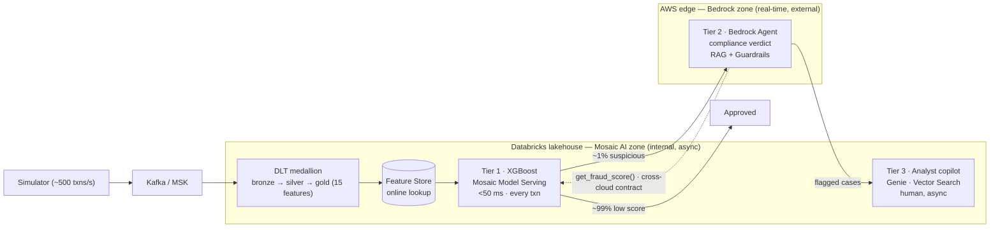

# FintelliGuard

[](https://github.com/theofanis-tsakanikas/fintelliguard/actions/workflows/ci.yml)

**Real-time financial fraud detection & compliance platform.**
*AWS Bedrock · Databricks Mosaic AI · Kafka/MSK · Spark · Terraform · LangGraph*

## The problem

Card-fraud systems fail on two fronts at once. Rule engines flag transactions *after*
approval, so losses are booked before an analyst opens the case. And AML/PSD2 require a
**documented, regulation-grounded justification for every flagged transaction** — work a
mid-size bank throws 40–80 analysts at. FintelliGuard scores every transaction in under
50 ms, auto-drafts a regulation-grounded compliance verdict for the suspicious ~1%, and
gives analysts an AI copilot to investigate the rest — attacking fraud latency and
compliance cost in one system.

## Architecture — three-tier decisioning, two-zone GenAI

A transaction flows through a funnel where each tier is more expensive and runs on a
smaller slice. The two GenAI zones live in their natural homes and are joined by a
**contract, not coupling**: Bedrock reaches the model only through `get_fraud_score()`.



- **Tier 1 — XGBoost on Mosaic AI Model Serving.** Scores 100% of transactions in
  <50 ms; ~99% pass and are done. The fast, numeric decision.
- **Tier 2 — AWS Bedrock Agent.** Only the suspicious ~1%. Calls back for the score via
  `get_fraud_score()`, grounds a compliance verdict in AML/PSD2 via RAG, and passes it
  through Guardrails. The slow reasoning layer — never the scorer.
- **Tier 3 — Databricks Mosaic AI copilot.** Human analysts investigate flagged cases
  asynchronously with NL→SQL (Genie), semantic retrieval (Vector Search), and the same
  `get_fraud_score()`. Decision support, not automation.

See [`docs/NARRATIVE.md`](docs/NARRATIVE.md) for the *why*, and
[`docs/PROJECT_PLAN.md`](docs/PROJECT_PLAN.md) for the full component inventory.

## Stack

| Layer | Technology |
|---|---|
| Ingestion (streaming) | Kafka / AWS MSK → Spark Structured Streaming |
| Ingestion (batch) | S3 → Databricks Auto Loader |
| Data platform | Databricks DLT · Unity Catalog · Delta Lake |
| ML training | XGBoost · MLflow · Mosaic AI Feature Store *(online lookup deferred — spec + injected-lookup seam today)* |
| ML serving | Mosaic AI Model Serving (REST, autoscale) — real XGBoost + TreeSHAP scorer, live in the local funnel |
| Real-time AI (Tier 2) | AWS Bedrock Agent · Knowledge Bases · Guardrails · Claude (Haiku 4.5 → Sonnet 4.6) — the *reasoner* is deferred to AWS; the verdict-acceptance gate + guardrail are real & CI-tested |
| Investigation AI (Tier 3) | Mosaic AI Agent Framework · Vector Search · Genie · Agent Evaluation |
| Self-healing | LangGraph Supervisor + Medic — bounded: rollback restricted to previously-promoted versions that still pass the promotion gate, a confirmation window before acting on latency, a hard action cap, durable retry state · LangSmith traces the healing graph only *(off by default; the Bedrock/copilot paths are NOT traced — deferred)* |
| IaC | Terraform (3 isolated layers) · Databricks Asset Bundles |
| CI/CD | GitHub Actions |
| Observability | Grafana · Prometheus — **live in the local end-to-end** (`make e2e`): the scorer emits the metrics the dashboards query · LangSmith *(deferred)* |

## Engineering highlights

- **Feature parity proven by independent paths.** One canonical schema for names and types,
  and — the half that was missing — one canonical *semantics* (`ml/features/semantics.py`),
  because both adapters satisfied the schema completely while disagreeing about what the
  numbers meant. One synthetic card journey is encoded two ways and run through both
  adapters; the vectors must match. A parity test means something only when the two sides
  are derived by paths that CAN disagree.
- **No target leakage, proven on both sides.** Window/state features use only transactions
  strictly *before* the current one — at serving AND at training, where the per-card
  aggregates were once computed over the whole group, future included. The test adds a
  later transaction and requires the earlier rows not to move.
- **Cross-cloud contract fidelity.** The Bedrock action-group Lambda's output equals the
  `ml/serving` scorer's output byte-for-byte — asserted in tests, so the two clouds stay
  in sync through the contract.
- **Per-prediction explanations.** `top_features` are exact **TreeSHAP** contributions
  (XGBoost `pred_contribs`) — *why this transaction* scored as it did, not global
  importance — feeding the agent's regulated reasoning.
- **Self-healing, with bounds that are tested.** A LangGraph Supervisor + Medic classifies
  health signals and applies deterministic, idempotent remediation — and is not trusted
  further than that: it may restore only a version that was itself in Production and still
  clears the promotion gate (a rollback is a promotion), a latency breach must persist
  across consecutive samples before it can move a model, and each healing thread has a hard
  action ceiling past which it pages a human instead of acting.
- **Security by default.** Least-privilege IAM (no authored wildcards — enforced by test,
  not by comment), customer-managed KMS, the regulatory vector store reachable only through
  a VPC endpoint, VPC flow logs, OIDC in every cloud workflow (no static keys), secrets only
  in AWS Secrets Manager / Databricks secret scopes, and **Guardrails** bound to the agent
  at an immutable policy version — with a test that the binding resolves, because it once
  did not. `make iac-scan` runs checkov; every skip carries its reason.
  *PrivateLink to the Mosaic endpoint is ready but off by default (`count = 0` without a
  service name) — see [docs/DEPLOY.md](docs/DEPLOY.md).*
- **Guardrails proven attached, not just configured.** A labelled red-team set runs against
  the offline guardrail policy model in CI. **Scope, stated plainly:** that model is a
  signature stand-in for Bedrock's classifier whose detectors were written from the probes
  they are scored against, so its block rate is a *regression score*, not a measured safety
  property — it is not quoted as one. What IS proven is the deployed shape: that the
  guardrail is bound to the agent, at an immutable version, with every policy class enabled
  and its thresholds matching the model.
- **Verdict acceptance gate.** Five deterministic checks before a Tier-2 verdict reaches an
  analyst: schema, no raw PII, **grounding** (every cited *provision* must appear in the
  retrieved context — set membership, not substring containment, so a fabricated article
  appended to a real one is refused), **faithfulness** (the verdict declares its drivers and
  they must be the model's actual `top_features` — prose cannot decide this), and
  **direction** (the agent may escalate with a reason and may never soften: releasing a
  transaction the model flagged is a human decision).
- **Decision records.** Every scored transaction — not only the flagged ~1% — writes one
  replayable record: input → the 15 features → `model_version`, score and `top_features` →
  the verdict, the gate result and the guardrail outcome, under a correlation id, refusing
  to be written if it would carry raw PII. So "which model decided this transaction, and
  what did its card say?" has an answer (AI Act Art. 12).
- **Drift detection.** PSI + two-sample KS per feature with alert thresholds.
  *Scope: a library and a threshold — no job computes it on a schedule yet.*
- **Regulated-AI docs generated from the code.** Model card, dataset card, and an
  **EU-AI-Act Annex IV** technical document are rendered from the actual features,
  thresholds, and guardrail coverage — CI fails if they drift. See
  [docs/governance/](docs/governance/README.md).
- **IaC only.** Three isolated Terraform layers with per-layer remote state + Databricks
  Asset Bundles. No console deployments.
- **Every gate is attacked in CI.** `make gate-attack` breaks each control on purpose
  — detaching the guardrail, restoring the off-by-one, softening a verdict, pre-filtering
  the DQ rows — and fails unless the real gate refuses it *for the right reason*. Each
  attack is a bug this repository actually shipped.

## Testing philosophy (honest)

Pure logic is **unit-tested locally with the real engines** — local **PySpark** for the
DLT transforms and dashboard SQL, real **XGBoost + MLflow** for training/serving, real
**LangGraph** for self-healing, real mocked-client bridges for the Bedrock Lambda and
Vector Search. Infrastructure is **offline-validated** (`terraform validate` per layer,
`databricks bundle validate` schema, `checkov`) with no cloud calls. **Cloud execution is
deferred** to a dedicated deploy phase — see [`docs/DEPLOY.md`](docs/DEPLOY.md). A reviewer
can clone this repo and run the entire suite on a laptop.

**And the tests are themselves tested.** This suite was green — every gate, every badge —
while the Bedrock guardrail was never attached to the agent, `merchant_risk_score` was the
constant 0.0 on every transaction ever scored, and the DLT data-quality metric reported
100% because the rows that could fail it had already been filtered out. The tests covering
all three passed, because each asserted the shape of a description rather than the
behaviour of a control: a `re.search` for `"PROMPT_ATTACK"` in a file, a comparison of
dataclass field types that cannot diverge, an expectation evaluated on a pre-filtered frame.

So `make gate-proof` breaks each control on purpose and demands the real gate refuse it.
Three rules keep that a proof rather than a ritual: every gate must be **green first** (a
red gate would "block" everything and prove nothing); a **non-zero exit is not evidence**
(an import error exits non-zero too — the *named* test must report the failure); and a
mutation whose target has moved is reported **STALE**, not passed. It has already caught
four of its own new gates leaking, one tautology written while removing tautologies, and a
PII detector with a random false-positive rate. `make gate-attack` narrates it.

## Business impact

Conservative estimates from **published industry benchmarks on synthetic data** — they
demonstrate the mechanism, **not measured production results**. Full context in
[`docs/NARRATIVE.md`](docs/NARRATIVE.md).

| Metric | Baseline | With FintelliGuard |
|---|---|---|
| Fraud detection latency | 2–4 h (batch) | < 50 ms |
| Compliance review per case | 45 min | ~3 min |
| False positive rate | ~8% | ~3% |
| Compliance analyst FTE | 40–80 | 10–20 (oversight) |

## Project status

**Built · locally validated · deploy-ready — not currently deployed.** Every layer is
implemented, the full test suite passes locally and in CI, and all infrastructure is
offline-validated. Provisioning real cloud resources is deliberately deferred (it incurs
cost); the ordered runbook is in [`docs/DEPLOY.md`](docs/DEPLOY.md). Nothing here claims a
running production system — but it is engineered to deploy from this state.

## Run the tests locally

Requires **Python 3.11+**, **Java 17** (for the PySpark tests), and the
OpenMP runtime for XGBoost (`brew install libomp` on macOS; bundled on Linux).

```bash
python3 -m venv .venv && source .venv/bin/activate
pip install -e ".[dev]"

make test            # pytest — full suite (local Spark + XGBoost + MLflow + LangGraph)
make lint            # ruff check
make fmt             # ruff format
make gate-proof      # break every control on purpose; each must be refused, for the right reason
make gate-attack     # the same, narrated — watch a control say no
make guardrail-scan  # run the guardrail red-team coverage gate
make iac-scan        # checkov over the Terraform layers (skips documented in .checkov.yml)
make govern-docs     # regenerate the model/dataset cards + AI-Act technical docs
```

Offline-validate the infrastructure (no cloud creds needed):

```bash
terraform -chdir=infra/aws validate          # after: terraform -chdir=infra/aws init -backend=false
cd infra/bundles && databricks bundle validate -t dev
```

## Run the funnel end-to-end locally (one command)

The excellent-but-unwired components — simulator, feature adapter, XGBoost scorer, verdict
gate, guardrail — are strung into a **running** funnel with no cloud, and the
Prometheus/Grafana observability becomes real (a live metrics emitter, not just dashboard
JSON):

```bash
make e2e        # docker compose: simulator -> Kafka -> scorer -> Prometheus -> Grafana
                # Grafana at http://localhost:3000 (admin / admin); scorer /metrics on :8000
make e2e-down   # stop + clean up
```

The scorer computes the 15 features with the SAME adapter Gold uses, scores + explains with
the real model (TreeSHAP), and runs flagged transactions through the real Tier-2
verdict-acceptance gate + output guardrail — emitting the exact metric series the dashboards
query. The Tier-2 *reasoner* is stubbed (the live Bedrock Claude call is deferred to AWS);
everything that judges the verdict is the shipping code. Details + honest scope:
[deploy/local/README.md](deploy/local/README.md). The funnel logic is unit-tested in
`tests/serving/test_local_runtime.py`.

## Repository layout

| Path | Purpose |
|---|---|
| [`infra/aws/`](infra/aws/) | TF layer 1 — VPC, KMS, S3, Secrets, IAM, MSK (cost-guarded); `bootstrap/` = state backend |
| [`infra/databricks/`](infra/databricks/) | TF layer 2 — workspace + Unity Catalog (customer-managed VPC) |
| [`infra/bundles/`](infra/bundles/) | Databricks Asset Bundles — DLT, serving, Vector Search, agent, grants |
| [`pipelines/`](pipelines/) | DLT bronze → silver → gold (testable transforms + thin `@dlt` layer) |
| [`ml/features/`](ml/features/) | Canonical 15-feature schema + stream/IEEE adapters (parity) |
| [`ml/training/`](ml/training/) | XGBoost + MLflow + promotion gate (AUC ≥ 0.92 ∧ precision ≥ 0.85) |
| [`ml/serving/`](ml/serving/) | `get_fraud_score()` scorer + MLflow pyfunc endpoint |
| [`ml/monitoring/`](ml/monitoring/) | Feature-drift detection (PSI + two-sample KS), NumPy-only |
| [`ml/governance/`](ml/governance/) | Generates the model/dataset cards + EU-AI-Act Annex IV doc from the code |
| [`agents/bedrock/`](agents/bedrock/) | Tier-2: action-group Lambda + agent/KB/guardrail Terraform |
| [`agents/bedrock/guardrails/`](agents/bedrock/guardrails/) | Guardrail policy model + labelled red-team set + coverage gate |
| [`agents/bedrock/eval/`](agents/bedrock/eval/) | Verdict acceptance gate (schema · no-PII · grounding · faithfulness · decision) |
| [`agents/databricks/`](agents/databricks/) | Tier-3: copilot tools + agent + eval harness |
| [`agents/langgraph/`](agents/langgraph/) | Self-healing Supervisor + Medic |
| [`simulator/`](simulator/) | ~500 txns/sec synthetic generator with fraud injection |
| [`dashboards/`](dashboards/) | Grafana dashboards (JSON) + data source provisioning |
| [`.github/workflows/`](.github/workflows/) | CI (PR validation) + gated bootstrap/deploy/destroy |
| [`docs/`](docs/) | Narrative, plan, data flow, features, integration contracts, deploy runbook |
| [`docs/governance/`](docs/governance/README.md) | Generated regulated-AI docs: model/dataset cards, guardrail coverage, AI-Act Annex IV |

## Docs

[NARRATIVE](docs/NARRATIVE.md) · [PROJECT_PLAN](docs/PROJECT_PLAN.md) ·
[data-flow](docs/data-flow.md) · [features](docs/features.md) ·
[bedrock-integration](docs/bedrock-integration.md) · [copilot-design](docs/copilot-design.md) ·
[DEPLOY](docs/DEPLOY.md)

Engineering rules are in [`CLAUDE.md`](CLAUDE.md).
